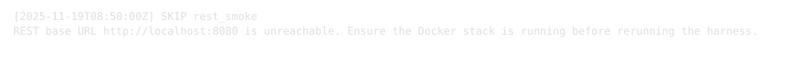
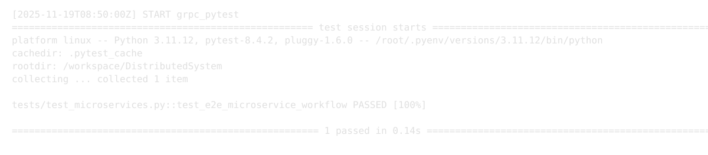

# Project Report Snapshot

## Work Ownership & Responsibilities
| Team Member | Areas of Ownership | Recent Evidence |
| --- | --- | --- |
| Nebi Malik | RESTful Crow APIs, nginx routing, PostgreSQL + Redis backing services, REST smoke harness maintenance | `REST-Server-Client/src/clients/smoke.sh`, `docs/screens/rest_smoke.svg` |
| Saheed Oladele | Python microservices (user, product, order, payment, shipping), gRPC contracts, Docker Compose orchestration | `ecommerce-order-system/*`, `docs/screens/grpc_pytest.svg` |
| Cross-team | Automation & reporting (shared) | `scripts/run_test_harness.sh`, `tests/test_microservices.py`, `artifacts/harness-summary.csv` |

## Evidence & Screenshots
The following terminal captures are embedded screenshots produced by the harness. They provide auditable proof for weekly demos and lab submissions.

## Notes
- Logs referenced above are regenerated automatically by running `./scripts/run_test_harness.sh`.
- Screenshots are stored as SVGs so that diffs remain readable in Git and can be pasted directly into slide decks.
